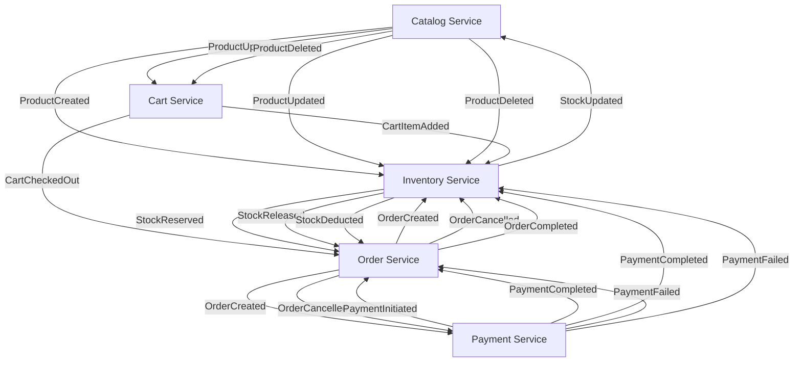

### **1. Catalog Service Integration Events**
**Responsibility**: Manage product catalog.

#### Events:
1. **`ProductCreated`**
    - **Payload**:
      ```json
      {
        "productId": "123",
        "name": "Product Name",
        "price": 100.0,
        "quantity": 50
      }
      ```
    - **Subscribers**:
        - **Inventory Service**: To create inventory for the new product.

2. **`ProductUpdated`**
    - **Payload**:
      ```json
      {
        "productId": "123",
        "price": 120.0,
        "quantity": 30
      }
      ```
    - **Subscribers**:
        - **Cart Service**: To update product prices in the cart.
        - **Inventory Service**: To sync inventory details.

3. **`ProductDeleted`**
    - **Payload**:
      ```json
      {
        "productId": "123"
      }
      ```
    - **Subscribers**:
        - **Cart Service**: To remove the product from any active carts.
        - **Inventory Service**: To remove inventory for the product.

---

### **2. Order Service Integration Events**
**Responsibility**: Manage customer orders.

#### Events:
1. **`OrderCreated`**
    - **Payload**:
      ```json
      {
        "orderId": "456",
        "userId": "789",
        "items": [
          { "productId": "123", "quantity": 2, "price": 100.0 },
          { "productId": "124", "quantity": 1, "price": 200.0 }
        ],
        "totalAmount": 400.0,
        "status": "PENDING"
      }
      ```
    - **Subscribers**:
        - **Inventory Service**: To reserve stock for the ordered items.
        - **Payment Service**: To initiate payment for the order.

2. **`OrderCancelled`**
    - **Payload**:
      ```json
      {
        "orderId": "456",
        "reason": "Customer request"
      }
      ```
    - **Subscribers**:
        - **Inventory Service**: To release reserved stock.
        - **Payment Service**: To process payment refunds if applicable.

3. **`OrderCompleted`**
    - **Payload**:
      ```json
      {
        "orderId": "456",
        "paymentId": "987",
        "status": "COMPLETED"
      }
      ```
    - **Subscribers**:
        - **Inventory Service**: To deduct stock permanently for completed orders.

---

### **3. Cart Service Integration Events**
**Responsibility**: Manage user carts.

#### Events:
1. **`CartItemAdded`**
    - **Payload**:
      ```json
      {
        "userId": "789",
        "productId": "123",
        "quantity": 2
      }
      ```
    - **Subscribers**:
        - **Inventory Service**: Optionally reserve stock for items in the cart (soft reservation).

2. **`CartCheckedOut`**
    - **Payload**:
      ```json
      {
        "userId": "789",
        "cartId": "567",
        "items": [
          { "productId": "123", "quantity": 2 },
          { "productId": "124", "quantity": 1 }
        ]
      }
      ```
    - **Subscribers**:
        - **Order Service**: To create an order from the cart contents.

---

### **4. Payment Service Integration Events**
**Responsibility**: Handle payments for orders.

#### Events:
1. **`PaymentInitiated`**
    - **Payload**:
      ```json
      {
        "paymentId": "987",
        "orderId": "456",
        "userId": "789",
        "amount": 400.0,
        "status": "PENDING"
      }
      ```
    - **Subscribers**:
        - **Order Service**: To update order status to "Awaiting Payment".

2. **`PaymentCompleted`**
    - **Payload**:
      ```json
      {
        "paymentId": "987",
        "orderId": "456",
        "status": "COMPLETED"
      }
      ```
    - **Subscribers**:
        - **Order Service**: To mark the order as "Confirmed".
        - **Inventory Service**: To confirm stock deduction for the order.

3. **`PaymentFailed`**
    - **Payload**:
      ```json
      {
        "paymentId": "987",
        "orderId": "456",
        "reason": "Insufficient funds"
      }
      ```
    - **Subscribers**:
        - **Order Service**: To update the order status to "Payment Failed".
        - **Inventory Service**: To release reserved stock.

---

### **5. Inventory Service Integration Events**
**Responsibility**: Manage product stock.

#### Events:
1. **`StockReserved`**
    - **Payload**:
      ```json
      {
        "orderId": "456",
        "items": [
          { "productId": "123", "quantity": 2 },
          { "productId": "124", "quantity": 1 }
        ]
      }
      ```
    - **Subscribers**:
        - **Order Service**: To confirm that stock is reserved for the order.

2. **`StockReleased`**
    - **Payload**:
      ```json
      {
        "orderId": "456",
        "items": [
          { "productId": "123", "quantity": 2 }
        ]
      }
      ```
    - **Subscribers**:
        - **Order Service**: To handle order cancellations or payment failures.

3. **`StockDeducted`**
    - **Payload**:
      ```json
      {
        "orderId": "456",
        "items": [
          { "productId": "123", "quantity": 2 },
          { "productId": "124", "quantity": 1 }
        ]
      }
      ```
    - **Subscribers**:
        - **Order Service**: To finalize the order status as "Completed".

4. **`StockUpdated`**
    - **Payload**:
      ```json
      {
        "productId": "123",
        "quantity": 100
      }
      ```
    - **Subscribers**:
        - **Catalog Service**: To reflect updated stock levels in product listings.

---

### **6. Integration Flow Example**

#### Scenario: Order Placement
1. **Cart Service**:
    - Publishes `CartCheckedOut`.
2. **Order Service**:
    - Receives `CartCheckedOut` and publishes `OrderCreated`.
3. **Inventory Service**:
    - Receives `OrderCreated` and publishes `StockReserved`.
4. **Payment Service**:
    - Receives `OrderCreated` and processes payment.
    - Publishes `PaymentCompleted` or `PaymentFailed`.
5. **Order Service**:
    - Receives `PaymentCompleted` and publishes `OrderCompleted`.

---


